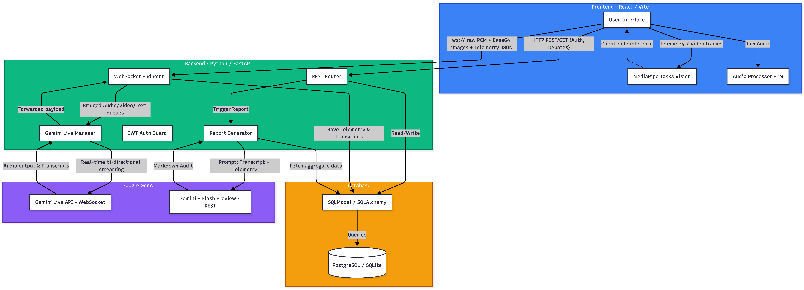

# Debate Guard 🛡️

Debate Guard is an adversarial AI debate simulator and coaching platform that acts as a live, adversarial opponent. It monitors your logical arguments and analyzes your body language (gaze, posture, shielding, etc.) in real-time, offering actionable feedback to help you become a better debater and speaker.

## Features

- **Live AI Debate:** A fierce, fast-paced Gemini-powered opponent that challenges your logical arguments relentlessly.
- **Coach Mode:** A supportive persona that weaves in logical feedback and body-language nudges organically.
- **Real-Time Body Language Heuristics:** Client-side tracking using MediaPipe to monitor your:
  - Gaze (eye contact)
  - Slouching/Posture
  - Defensive Shielding (crossed arms)
  - Yaw Instability (looking side-to-side)
  - Self-Soothing (touching face/neck)
  - Swaying and Tilting
- **Live Truth-Checking:** The AI automatically uses Google Search to fact-check the statistics and claims you make on the fly.
- **Comprehensive Post-Debate Analytics:** Generates a highly detailed breakdown of your rhetorical effectiveness, logical fallacies, and physical stage presence.

## Tech Stack

- **Backend:** Python + FastAPI + SQLModel + SQLite
- **AI Integration:** Google GenAI SDK (Gemini Live API)
- **Frontend:** React + Vite + TypeScript + TailwindCSS
- **Real-Time Streaming:** WebSockets (Audio and Video frames)
- **Computer Vision:** MediaPipe Vision API for Face/Pose landmarks

## Setting Up and Running

The project includes a convenient runner script `run.sh` to handle dependencies and startup.

### First-Time Setup
If this is your first time running Debate Guard, or if you need to install missing dependencies, start the project with the setup flag:

```bash
./run.sh -setup
```

This will automatically:
1. Initialize python dependencies (`uv sync`)
2. Install Node.js frontend dependencies (`npm install`)
3. Boot up the services

### Standard Run
If you already have your dependencies installed, simply run:

```bash
./run.sh
```

**If you try to run the project without dependencies installed, the script will gracefully exit and prompt you to use the `-setup` flag.**

Services will be accessible at:
- **Frontend App:** [http://localhost:5173](http://localhost:5173)
- **Backend API:** [http://localhost:8000](http://localhost:8000)

## Environment Variables

Make sure to configure your `.env` file in the `backend/` directory:

```env
GEMINI_API_KEY=your_gemini_api_key_here
```

## Architecture

Below is a high-level representation of the Debate Guard architecture:


